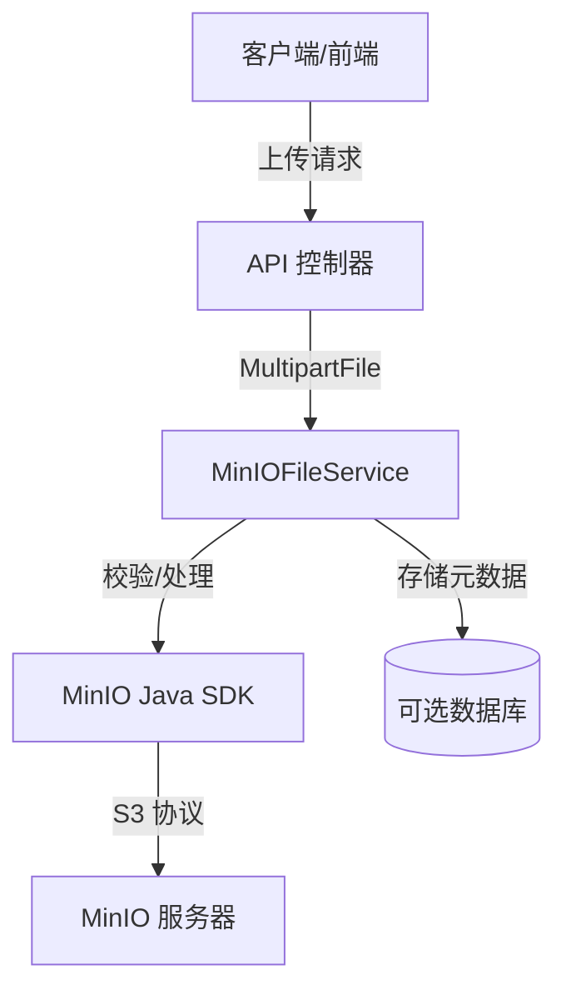

# QAssistant-MinIO 模块集成指南

## 1. 模块概述
本模块为 QAssistant 集成了 MinIO 对象存储服务，提供文件上传、下载和管理功能。支持图片处理（缩略图）、元数据存储和安全 URL 生成。

## 2. 架构
集成遵循标准的 Spring Boot 服务架构：



### 核心组件
- **MinIOConfigProperties**: 配置映射 (`minio.*`)。
- **MinIOConfig**: `MinioClient` 的 Bean 配置。
- **MinIOFileService**: 文件操作核心服务。
- **FileUploadResponse**: 统一响应 DTO。

## 3. 配置

请在 `application.yml` 或 `application.properties` 中添加以下属性：

```yaml
minio:
  endpoint: http://localhost:9000  # MinIO 服务器地址
  access-key: minioadmin           # Access Key
  secret-key: minioadmin           # Secret Key
  bucket-name: qassistant          # 默认存储桶名称
  connect-timeout: 10000           # 连接超时 (ms), 默认 10s
  write-timeout: 10000             # 写入超时 (ms), 默认 10s
  read-timeout: 10000              # 读取超时 (ms), 默认 10s
```

### 环境变量配置示例
您可以使用环境变量来存储敏感数据：
```bash
export MINIO_ENDPOINT=http://192.168.1.100:9000
export MINIO_ACCESS_KEY=myaccesskey
export MINIO_SECRET_KEY=mysecretkey
```
并在 Spring 中引用它们：
```yaml
minio:
  endpoint: ${MINIO_ENDPOINT}
  access-key: ${MINIO_ACCESS_KEY}
  secret-key: ${MINIO_SECRET_KEY}
```

## 4. API 使用指南

### 4.1 依赖注入
将 `MinIOFileService` 注入到您的控制器或服务中：

```java
@Autowired
private MinIOFileService minIOFileService;
```

### 4.2 通用文件上传
支持 PDF, DOC, DOCX, MD, TXT, XLS, XLSX, PPT, PPTX。

```java
@PostMapping("/upload")
public FileUploadResponse upload(@RequestParam("file") MultipartFile file) {
    return minIOFileService.uploadFile(file, "my-bucket");
}
```

### 4.3 图片上传（头像）
支持 JPG, PNG, GIF, WEBP。
可选缩略图生成（50% 缩放）。

```java
@PostMapping("/avatar")
public FileUploadResponse uploadAvatar(@RequestParam("file") MultipartFile file) {
    // 上传到 'avatars' 存储桶，并生成缩略图
    return minIOFileService.uploadImage(file, "avatars", true);
}
```

### 4.4 获取文件 URL
获取临时预签名 URL（有效期 1 小时）：

```java
String url = minIOFileService.getPreviewUrl("my-bucket", "2023/10/01/uuid.jpg");
```

### 4.5 删除文件

```java
minIOFileService.removeFile("my-bucket", "2023/10/01/uuid.jpg");
```

## 5. 返回格式
`FileUploadResponse` 对象包含：

```json
{
  "fileId": "2023/10/01/550e8400-e29b-41d4-a716-446655440000.jpg",
  "fileName": "2023/10/01/550e8400-e29b-41d4-a716-446655440000.jpg",
  "originalName": "avatar.jpg",
  "fileSize": 102400,
  "fileUrl": "http://minio:9000/avatars/...?Signature=...",
  "mimeType": "image/jpeg",
  "uploadTime": "2023-10-01T12:00:00"
}
```

## 6. 故障排查

| 错误 | 原因 | 解决方案 |
|-------|-------|----------|
| `MinioException: Check bucket failed` | 连接被拒绝或凭证无效 | 检查 MinIO 服务器状态和 `application.yml` 凭证。 |
| `IllegalArgumentException: File type not allowed` | 上传了不支持的文件扩展名 | 检查 `MinIOFileService` 中的 `ALLOWED_EXTENSIONS`。 |
| `IllegalArgumentException: Image size exceeds limit` | 文件大于 5MB | 压缩图片或在代码中增加限制。 |
| `ErrorResponseException: The specified bucket does not exist` | 存储桶未找到且自动创建失败 | 确保用户拥有 `s3:CreateBucket` 权限或手动创建存储桶。 |

## 7. 安全与最佳实践
- **白名单**：仅接受允许的扩展名。
- **存储桶策略**：使用 `setBucketPolicy` 切换公开/私有访问。
- **预签名 URL**：文件访问的默认方式，以确保安全。
- **元数据**：原始文件名和 MD5 值存储为 MinIO 对象的元数据。
